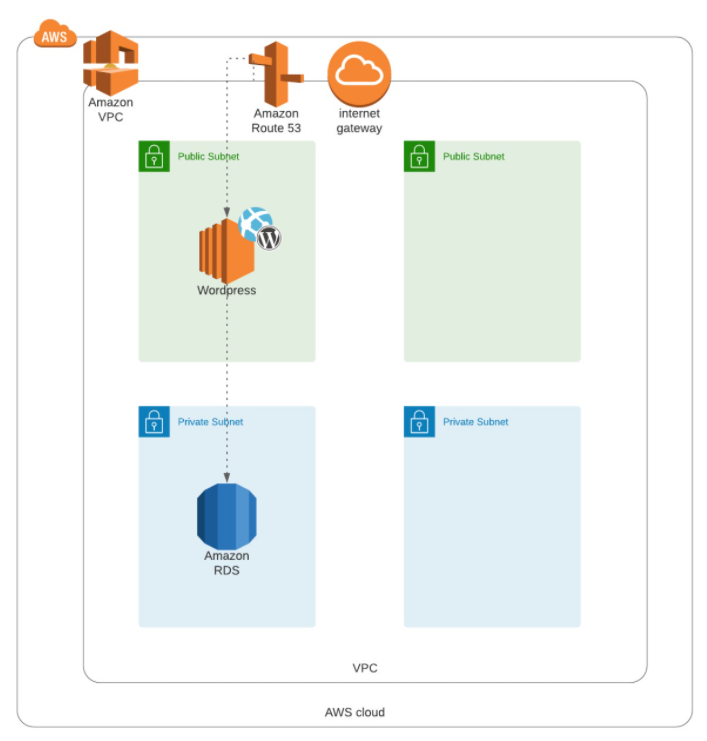
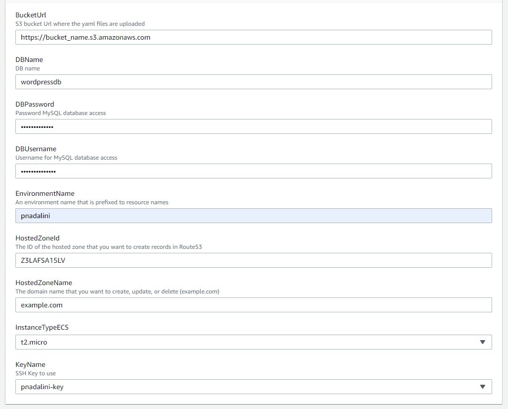
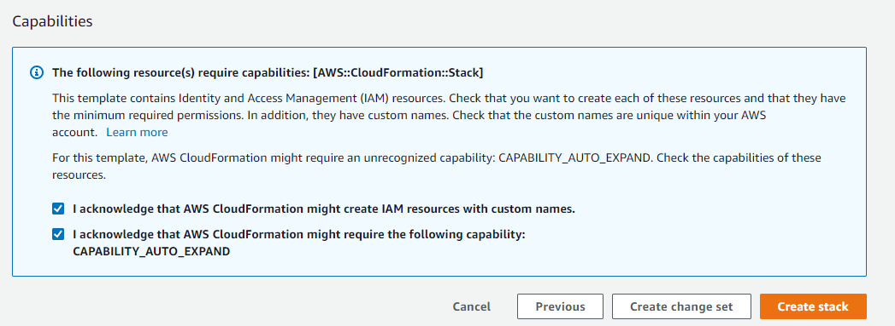

# WordPress on AWS

This reference architecture provides a set of YAML templates for deploying WordPress on AWS with [AWS CloudFormation](http://docs.aws.amazon.com/AWSCloudFormation/latest/UserGuide/Welcome.html) using the following resources:
* [Amazon Virtual Private Cloud (Amazon VPC)](http://docs.aws.amazon.com/AmazonVPC/latest/UserGuide/VPC_Introduction.html)
* [Amazon Elastic Compute Cloud (Amazon EC2)](http://docs.aws.amazon.com/AWSEC2/latest/UserGuide/concepts.html)
* [Amazon Relational Database Service (Amazon RDS)](http://docs.aws.amazon.com/AmazonRDS/latest/UserGuide/Welcome.html)
* [Amazon Route 53](http://docs.aws.amazon.com/Route53/latest/DeveloperGuide/Welcome.html)

If you have any questions about the resources or about what CloudFormation is, you can check the links above to understand the concept

## Overview

## Steps to Run and Explanation

This has a stack configuration, meaning that you only need to run the `main.yaml` in CloudFormation and it will run the other yaml files to deploy the architecture shown above.

### Upload the yaml files to S3

In order to find the files from the main, you need to upload all your `.yaml` files to an S3 Bucket in AWS, this will also make it easier for you and your team to see what the configuration files were used from CloudFormation.

You can also enable versioning in S3 if you want to keep track of the updates to the configuration files.

### Create the Stack in CloudFormation

In AWS go to the CloudFormation Service and create a new stack with new resources. In there you can write the url of your `main.yaml` file in S3 like https://<bucket_name>.s3.amazonaws.com/main.yaml. After that, click next and fill in the parameters with your information:

If you don't have a key, you can go to EC2 Service in AWS and create one in "Network & Security" > "Key Pairs".

If you want to add more parameters, you can modify the yaml configuration files to add anything extra that you need.

After filling the parameters and writing a stack name, you can just click next and acknowledge the options shown by AWS. If you want to be more secure, you can configure an IAM Role in the previous step with the minimum required permissions.

And that's it, you just have to create the stack and wait a couple of minutes for everything to get configured. Then you'll be able to navigate to your Wordpress site in the domain name you added to the parameters if nothing fails.
